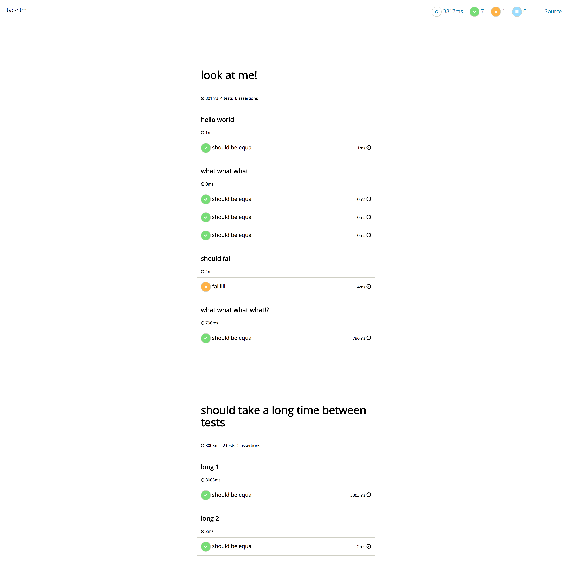

# tap-html

[](https://greenkeeper.io/)

> an html tap reporter

[](https://www.npmjs.com/package/tap-html)
[](https://travis-ci.org/gabrielcsapo/tap-html) 
[](https://david-dm.org/gabrielcsapo/tap-html)
[](https://david-dm.org/gabrielcsapo/tap-html#info=devDependencies)
[]()
[]()

## Installation

```
npm install tap-html --save-dev
```

## Usage

> This will generate a tap-html.html file

```
tape test/**.js | tap-html
```

## Example


